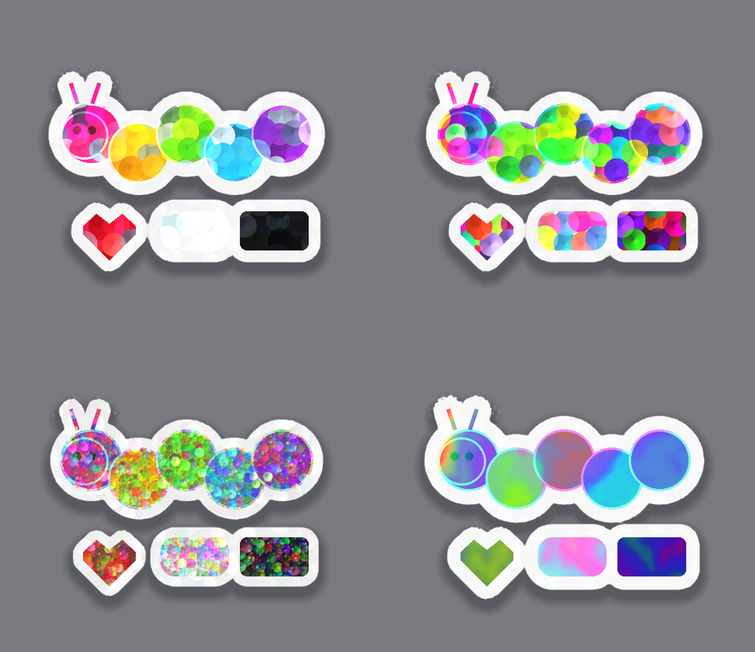
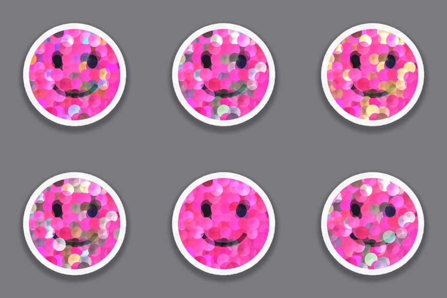
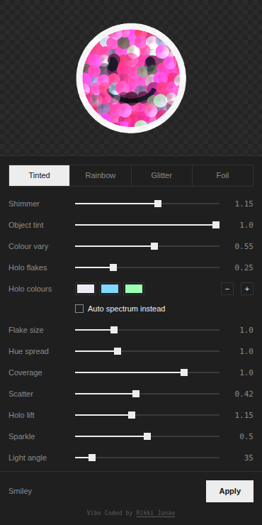

# Holo Sticker — a Figma plugin by Rikki Janae

Turns any selected layer into a 90s/00s holographic sticker — the overlapping
sequin flakes, the die-cut white edge, the silver and blue flashes between the
colours. The effect is rendered in WebGL on the exported pixels (not vector),
then dropped back into your file as an image layer.



The flakes take their colour from the artwork underneath them, so a pink
sticker stays pink and a black one stays black. The flash flakes between them
are yours to colour:





## Install

1. Download or clone this repo.
2. Figma **desktop app** → menu → **Plugins → Development → Import plugin from manifest…**
3. Pick `manifest.json` from the folder.
4. Select a layer, then **Plugins → Development → Holo Sticker by Rikki Janae**.

No build step needed to run it — `ui.html` is committed pre-built.

## Presets

| | |
|---|---|
| **Tinted** | Confetti discs that take their colour from the artwork underneath, with a scattering of rainbow/silver flakes between — the Sandylion sticker-sheet look. |
| **Rainbow** | Same discs, full spectrum, ignoring the artwork's colour. |
| **Glitter** | Dense fine grain, like glitter cardstock. |
| **Foil** | No particles — flowing oil-slick film. |

All four are just starting points for the same shader — the sliders move freely between them.

## Controls

- **Shimmer** — overall strength of the holo layer.
- **Object tint** — 0 = every flake is full spectrum; 1 = each flake takes the colour of the artwork under its centre and stays at that lightness. A black sticker stays black, a pink one stays pink.
- **Colour vary** — how far each flake's hue and saturation drift from the object's own colour. A pink sticker at 0 is one flat pink; at 0.55 you get magenta, coral and pale-pink flakes mixed through it.
- **Holo flakes** — what fraction of the flakes are iridescent flashes rather than object-coloured. They're recoloured at the artwork's own lightness, so they read as holo film catching the light, not as rainbow confetti dropped on top.
- **Holo colours** — a palette of up to four colours for the flash flakes; each flake picks one at random. The default is silver / sky blue / mint, which is what most of the reference sheets use. **+ / −** add and remove swatches. Tick **Auto spectrum instead** to let them run through the rainbow; touching a swatch unticks it for you. The palette survives preset switches. A hand-picked colour composites nearly opaque so it survives being laid over saturated artwork, and skips the dark-ink desaturation that Auto applies.
- **Holo lift** — how much brighter the flash flakes are allowed to be than the artwork. Push this up to make gold or silver pop on a dark sticker; pull it down to keep everything flush.
- **Flake size** — scales the discs (in design px, so it's resolution-independent). The discs overlap into a full mosaic with no gaps, like the reference sheets; this only changes how many there are.
- **Hue spread** — how much of the spectrum the flakes span. Low = tonal, high = full rainbow.
- **Scatter** — how far each flake is jittered off its grid cell. Low = evenly packed confetti (the reference sheets), high = loose and clumpy.
- **Sparkle** — the white specular pops on individual flakes.
- **Light angle** — direction the light sweeps from; each flake shades from that side.
- **Gloss** — broad plastic highlight across the whole sticker.
- **Die-cut border** — white vinyl edge, with optional silver-holo glitter in it.
- **Drop shadow** — soft shadow under the die-cut silhouette.
- **Resolution** — 2x/3x/4x export. Auto-caps so the result stays under Figma's 4096px image limit.
- **Shuffle** — re-rolls the flake scatter.

Multi-select works: it processes every selected layer in one go.

## Performance notes

- The preview is rendered from a **small export** (capped at 640 px) — everything in the shader is in design px, so it looks identical to the full-resolution result. Apply re-exports at the resolution you chose.
- The distance field (pass 1) is **cached** and only recomputed when the source or the padding changes, so slider drags only pay for the composite pass.
- The border and shadow are only evaluated where they can show; the artwork pass is skipped over transparent pixels.
- Selection changes are debounced (120 ms) so scrubbing through layers doesn't queue an export for each one.

## Editing it

`ui.html` is generated — don't edit it directly. Edit the sources and rebuild:

```
src/ui.head.html   markup + CSS for the panel
src/holo.js        the WebGL pipeline (this is where the look lives)
src/app.js         panel controller, state, messaging
code.js            Figma main thread: export, insert the image node

node build.js      → writes ui.html
```

Then hit **Plugins → Development → Hot reload plugin** in Figma (or just re-run it).

### Tests

The shader is exercised headlessly in Chromium via Playwright — no Figma needed:

```
npm install
npx playwright install chromium
npm test                      # renders all four presets + drives the panel
node test/vary.js test/smiley.png smiley   # holo-palette sweep
node test/perf.js             # render timings, cached vs uncached
```

Rendered output lands in `test/` as `p-*.png` / `v-*.png` (gitignored).

### Where the look lives

`src/holo.js` has two fragment shaders:

- `FRAG_SDF` — distance-to-nearest-opaque-pixel, computed at quarter res with a
  coarse ring search plus a local refine. Drives the die-cut border and the shadow.
- `FRAG_COMPOSITE` — the actual effect. `flakes()` scatters metallic discs on a
  jittered grid (two layers at different sizes), `foil()` is domain-warped fbm,
  `pal()` is the cosine spectrum, and `layFlake()` is the blend that keeps the
  artwork readable while the flakes still read as metal.

  Tinting happens inside `flakes()`: each disc samples the source **at its own
  centre**, not per-pixel, so the whole flake is one flat colour — a sequin
  sitting on the ink rather than a filter over it. That colour gets its chroma
  pushed and its lightness varied per flake, which is what gives the faceted
  deep-to-pale range within a single hue.

Everything in the composite shader is authored in **design px** (`pd = px / uScale`),
so flake size stays constant whether you export at 2x or 4x.

### Ideas to push it further

- A second SDF-driven inner bevel so the vinyl edge catches light.
- Lenticular line ruling (a fine repeating gradient) for the "prismatic stripe" sheets.
- Star/hex flake shapes instead of discs — swap the `length(f - c)` distance for a
  polygon SDF in `flakes()`.
- Paper-backing texture and a slight peel/curl warp.
- Animate `uAngle` and export a frame sequence for a tilting-sticker GIF.

## Licence

MIT — see [LICENSE](LICENSE). Made by [Rikki Janae](https://rikkijanae.com).
